# Mini-Project
# EXPLORATORY DATA ANALYSIS ON ALCOHOL CONSUMPTION
## AIM
To implement the exploratory data analysis of alcohol consumption .
## ALGORITHM
### STEP1:
Get a dataset for the required process.
### STEP2:
Upload the dataset in google collaboratory.
### STEP3:
In the collab ,import the necessary packages. 
### STEP4:
Detect the outlier and plot the graph.
### STEP5:
Remove the outliers and standardize the analyzation by using Zscore.
### STEP6:
Run the program and get the desired results.

## PROGRAM
```python
import pandas as pd
import numpy as np
import matplotlib.pyplot as plt
import seaborn as sns
df=pd.read_csv("/content/student-mat.csv")
df

df.head()

df.info()

df.isnull().sum()

df.describe

df.shape

sns.boxplot(data=df)

df.drop('age',axis=1)
sns.boxplot(x='age',data=df)

q1 = df['age'].quantile(0.35)
q3 = df['age'].quantile(0.65)
print("First Quantile =",q1,"\nSecond Quantile =",q3)

IQR = q3-q1
high = q3+1.5*IQR
low = q1-1.5*IQR
df1 =df[((df['age']>=low)&(df['age']<=high))]
df1

sns.boxplot(x="age",data=df1)

df1.shape

from scipy import stats
import numpy as np
z = np.abs(stats.zscore(df['age']))
df2 = df[(z<3)]
df2
df2.shape

sns.boxplot(x="age0",data=df2)
```
## OUTPUT
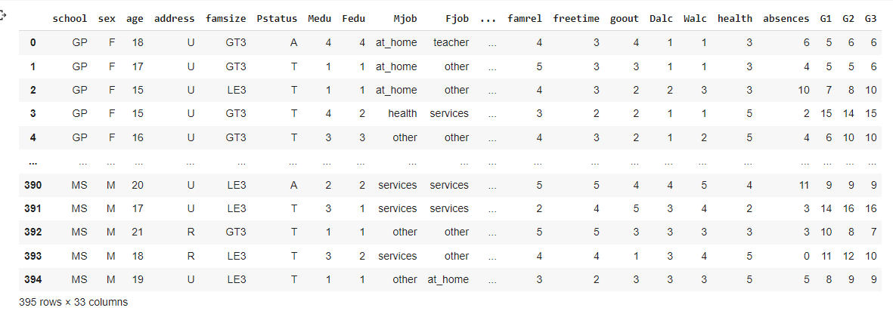
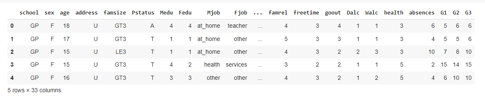
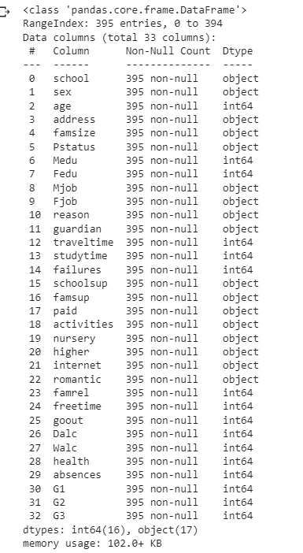
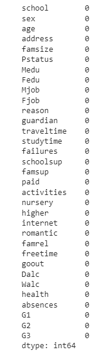
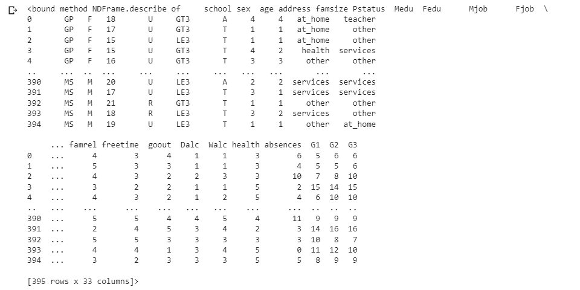
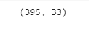
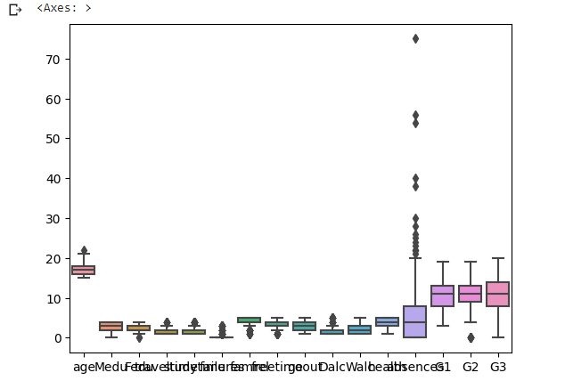
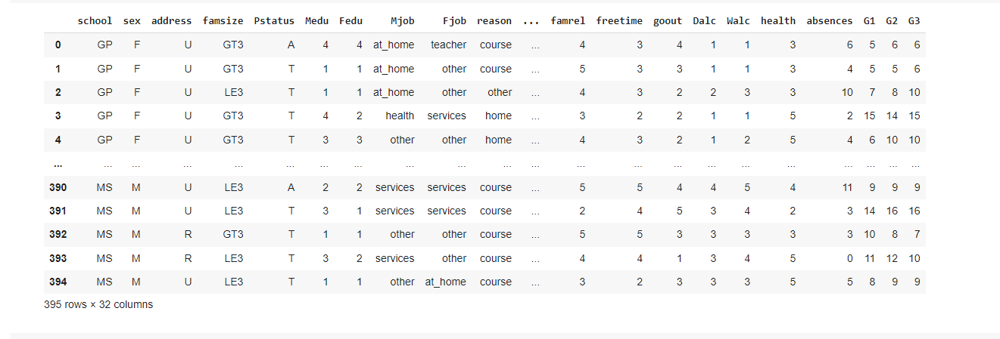
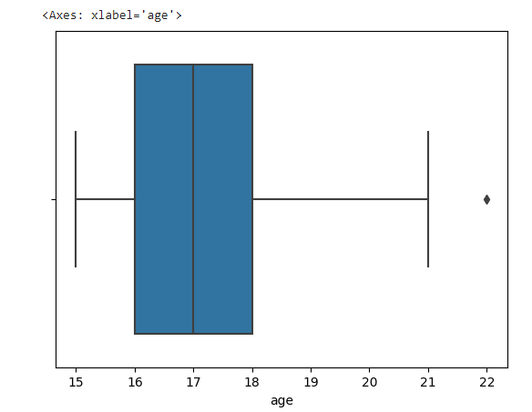
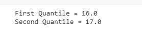
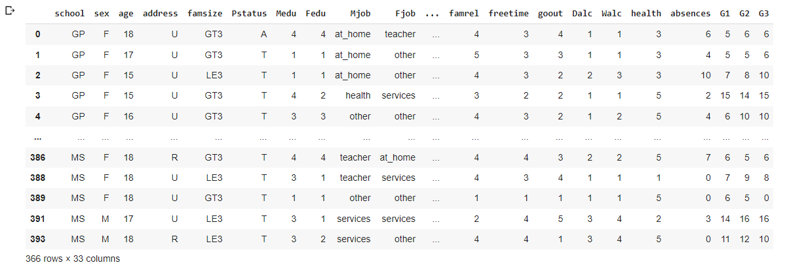
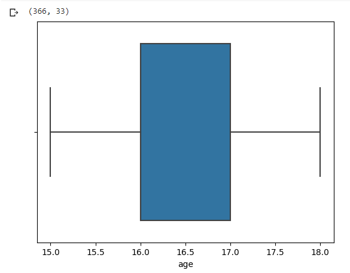
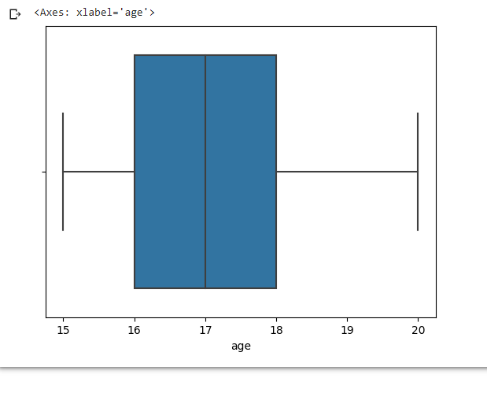

## RESULT
Hence the implementation of data analysis of alcohol consumption is detected successfully.